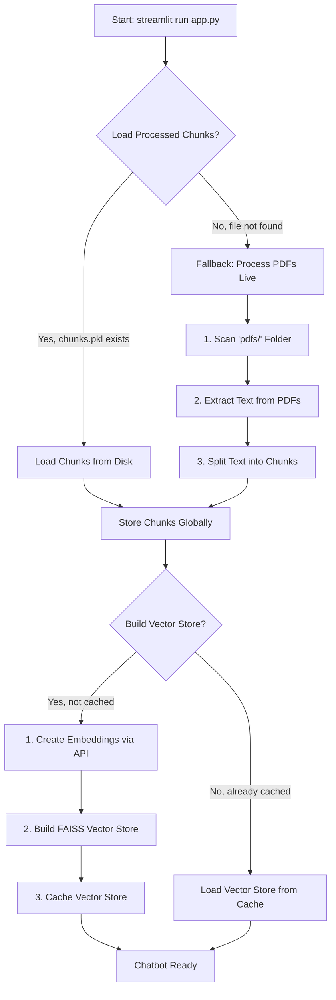
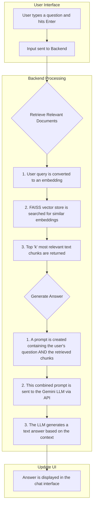

# RAG Chatbot Application Workflow

This document provides a visual flowchart of the application's lifecycle, from the moment you run `streamlit run app.py` to when the AI provides an answer.

## 🚀 Application Startup Flow

This is what happens when the application first loads.

**Explanation:**

1.  **Start**: The user executes `streamlit run app.py`.
2.  **Load Chunks**: The app first tries to load the fast, pre-processed text chunks from the `processed_data/` directory.
3.  **Fallback to Live Processing**: If no pre-processed chunks are found, it processes the PDFs in the `pdfs/` directory on-the-fly. This is slower and only happens on the first run or if the processed data is deleted.
4.  **Store Chunks**: The text chunks (either from disk or live processing) are loaded into memory.
5.  **Build Vector Store**: The app checks its cache for a ready-to-use vector store.
6.  **API Call**: If the vector store isn't cached, the app sends the text chunks to the Google Gemini API to get numerical representations (embeddings). **(This is a key network step).**
7.  **FAISS Index**: It then uses these embeddings to build a `FAISS` vector store, which is like a searchable index for the documents.
8.  **Caching**: This newly created vector store is cached in memory so it doesn't have to be rebuilt on every interaction.
9.  **Ready**: The application displays the chat interface, ready for user input.

---

## 💬 User Query Flow

This is the sequence of events that occurs every time a user asks a question.

**Explanation:**

1.  **User Input**: The user types a question in the Streamlit web interface.
2.  **Vector Search (Retrieval)**:
    *   The user's question is converted into a vector embedding using the same model that was used for the documents.
    *   The `FAISS` vector store is searched to find the text chunks with embeddings that are mathematically most similar to the question's embedding.
    *   The top `k` (currently 10) most relevant chunks are "retrieved".
3.  **Answer Generation (Augmentation)**:
    *   A special prompt is constructed. It essentially says: *"Based on the following context, answer the user's question. Context: [retrieved chunks]. Question: [user's question]"*.
    *   This complete prompt is sent to the selected Gemini LLM (`gemini-pro`, etc.).
    *   The LLM uses the provided context to formulate an answer. This prevents it from using its general knowledge and forces it to use the information from your documents.
4.  **Display Output**: The final answer from the LLM is sent back to the Streamlit interface and displayed to the user.